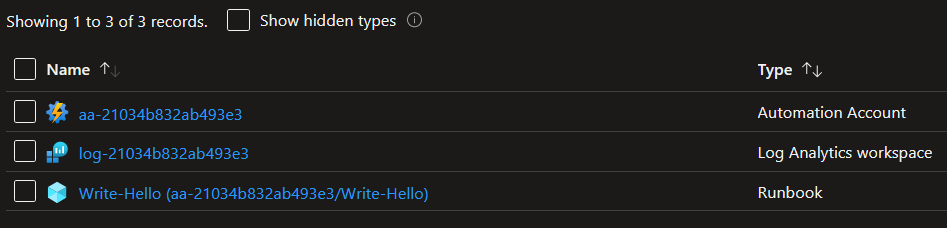

# Equinor Terraform Baseline

Equinor Terraform Baseline (ETB) is:

- A set of best practices for creating reusable Terraform modules using the Azure provider.
- A library of reusable Terraform modules that have been created using these best practices.

ETB is currently written as an extension of [Terraform Best Practices](https://www.terraform-best-practices.com), however the long-term goal is for ETB to be a complete replacement.

Before using ETB, you should be familiar with the following pages from the official Terraform documentation:

- [Standard Module Structure](https://developer.hashicorp.com/terraform/language/modules/develop/structure)
- [Version Constraints](https://developer.hashicorp.com/terraform/language/expressions/version-constraints)
- [Publishing Modules](https://developer.hashicorp.com/terraform/registry/modules/publish)

## Best Practices

- Use [this template](https://github.com/equinor/terraform-module-template) when creating your repository.

- The following accesses should be configured for the repository:

  | Team | Role |
  | --- | --- |
  | @equinor/terraform-baseline | `Write` |
  | @equinor/terraform-baseline-admins | `Admin` |

- The following code owners should be configured in a file `.github/CODEOWNERS`:

  ```raw
  * @equinor/terraform-baseline
  ```

### Naming convention

- Use the common naming convention `terraform-azurerm-<name>` when naming your repository.
  For example, if you want to create a module named `storage`, the repository should be named `terraform-azurerm-storage`.

### Roles and scope

- Use resources that do not require more than `Contributor` role at the resource group scope.
  If you need to use a higher role, create an example instead.

### Hidden resources

- Don't create resources that are automatically created by Azure, e.g. hidden resources such as the `master` database for an Azure SQL server:

  

### One-on-one mapping

There should be a one-to-one mapping between module calls and visible resources in Azure.

- For example, consider the following module calls:

  | Module name   | Module source                                 | Created Azure resources                                                                                                                                   |
  | ------------- | --------------------------------------------- | --------------------------------------------------------------------------------------------------------------------------------------------------------- |
  | log-analytics | `equinor/log-analytics/azurerm`               | Log Analytics workspace + extension resources (diagnostic setting)                                                                                        |
  | automation    | `equinor/automation/azurerm`                  | Automation account + child resources (schedules, modules, credentials, connections, certificates, variables) and extension resources (diagnostic setting) |
  | runbook       | `equinor/automation/azurerm//modules/runbook` | Automation runbook + child resources (job schedules)                                                                                                      |

- Each module call corresponds to a single visible resource in the Azure portal:

  

### Variables

- All arguments should be made available as variables with sensible default values to make the module as generic as possible. Default values should be the most generic and secure values possible.

   > **Example generic value:** `account_kind` set to `StorageV2` instead of  `BlobStorage` for `storage` module.
   >
   > **Example secure value:** `min_tls_version` set to `1.2` instead of `1.0` for `storage` module.

- Required variables (variables without default values) should be placed first in `variables.tf`.

#### Variable naming convention

Variables and outputs should follow a common naming convention `<resource>_<block>_<argument>`, where `<resource>` and/or `<block>` can be omitted if not applicable.

- Use `description` to explain the use case of variables and outputs.

  ```terraform
  variable "vault_name" {
    description = "The name of this key vault."
    type        = string
  }

  variable "diagnostic_setting_name" {
    description = "The name of this diagnostic setting."
    type        = string
  }

  variable "network_acls_virtual_network_subnet_ids" {
    description = "A list of virtual network subnet IDs that should be able to bypass the network ACL and access this key vault."
    type        = list(string)
    default     = []
  }

  resource "azurerm_key_vault" "this" {
    name = var.vault_name
    # omitted

    network_acls {
      # omitted
      virtual_network_subnet_ids = var.network_acls_virtual_network_subnet_ids
    }
  }

  resource "azurerm_monitor_diagnostic_setting" "this" {
    name               = var.diagnostic_setting_name
    target_resource_id = azurerm_key_vault.this.id
    # omitted
  }
  ```

  > **Known exceptions to this rule:**
  >
  > - Variable names that contain the module name. For example, in module `storage` the variable `storage_account_name` should be named `account_name` instead.

### Modules

- A single module call should create a single instance of the main resource created by the module. For example, the `web-app` module should create a single web app, and the `sql` module should create a single database. This creates a common expectation for the behavior of our modules.

#### Control plane and data plane

- A module should only perform control plane operations (e.g., managing Storage account or Key vault), not data plane operations (e.g., managing Storage container or Key vault secret). See [control plane and data plane](https://learn.microsoft.com/en-us/azure/azure-resource-manager/management/control-plane-and-data-plane) in Microsoft docs.

  Performing data plane operations usually require workarounds for dealing with firewalls when run from an automated pipeline that deviate from the deterministic approach promoted by Terraform (e.g, temporarily disabling firewall or temporarily adding own IP to firewall).
  This may lead to the decision of disabling a resource firewall because it is preventing data plane operations from a pipeline, lowering the security of the resource.

  Data plane operations should be handled outside of Terraform.

  > **Note** Might be irrelevant depending on the implementation of github/roadmap#614.

### Automated tests

- Automated tests should be implemented for all variants of the relevant resource using [Terratest](https://terratest.gruntwork.io/). For example, in the `storage` module, automated tests should be implemented for standard GPv2 storage, premium GPv2 storage, standard blob storage, premium block blob storage and premium file storage.

### Resources

#### Repeatable resources

- For repeatable resources that extend the main resource, use a variable of type `map(object())` to dynamically create the resources, where setting the value to `{}` will not create any resources.

    ```terraform
    variable "server_name" {
      description = "The name of this SQL server."
      type        = string
    }

    variable "firewall_rules" {
      description = "A map of firewall rules to create for this SQL server."

      type = map(object({
        name             = string
        start_ip_address = string
        end_ip_address   = string
      }))

      default = {
        this = {
          name             = "AllowAllWindowsAzureIps"
          start_ip_address = "0.0.0.0"
          end_ip_address   = "0.0.0.0"
        }
      }
    }

    resource "azurerm_mssql_server" "this" {
      name = var.server_name
      # omitted
    }

    resource "azurerm_mssql_firewall_rule" "this" {
      for_each = var.firewall_rules

      name             = each.value.name
      server_id        = azurerm_mssql_server.this.id
      start_ip_address = each.value.start_ip_address
      end_ip_address   = each.value.end_ip_address
    }
    ```

#### Repeatable nested blocks

- For repeatable nested blocks, use a variable of type `list(object())` to dynamically create the nested blocks, where setting the value to `[]` will not create any nested blocks:

    ```terraform
    variable "auth_settings_active_directory" {
      description = "A list of authentication settings using the Active Directory provider to configure for this Linux web app."

      type = list(object({
        client_id                  = string
        client_secret_setting_name = string
      }))

      default = []
    }

    resource "azurerm_linux_web_app" "this" {
      # omitted

      auth_settings {
        enabled = length(var.auth_settings_active_directory) == 0 ? false : true

        dynamic "active_directory" {
          for_each = var.auth_settings_active_directory

          content {
            client_id                  = active_directory.value["client_id"]
            client_secret_setting_name = active_directory.value["client_secret_setting_name"]
          }
        }
      }
    }
    ```

#### Non-repeatable nested blocks

- For non-repeatable nested blocks, use a variable of type `object()` to dynamically create the nested block, where setting the value to `null` will not create the nested block.

  **Note:** This is important because the nested block may not be supported in certain scenarios. For example, `blob_properties` for `azurerm_storage_account` is only supported if `account_kind` is set to `StorageV2` or `BlobStorage`.

    ```terraform
    variable "account_kind" {
      description = "The kind of storage account to create."
      type        = string
      default     = "StorageV2"
    }

    variable "blob_properties" {
      description = "The blob properties for this storage account."

      type = object({
        versioning_enabled  = optional(bool, true)
        change_feed_enabled = optional(bool, true)
      })

      default = {}
    }

    resource "azurerm_storage_account" "this" {
      # omitted
      account_kind = var.account_kind

      dynamic "blob_properties" {
        for_each = var.blob_properties != null ? [var.blob_properties] : []

        content {
          versioning_enabled  = blob_properties.value["versioning_enabled"]
          change_feed_enabled = blob_properties.value["change_feed_enabled"]
        }
      }
    }
    ```

    > Known exceptions to this rule would be:
    >
    > - Blocks that are defined as required by the provider (e.g. the `site_config` block for the `azurerm_linux_web_app` resource).
    > - Blocks that are optional but requires an argument to enable/disable its functionality (e.g. the `auth_settings` block for the `azurerm_linux_web_app` resource which requires an argument `enabled`).

### Lifecycle meta-argument

- The `prevent_destroy` [lifecycle meta-argument](https://developer.hashicorp.com/terraform/language/meta-arguments/lifecycle) should be used sparingly. A [`CanNotDelete` lock](https://learn.microsoft.com/en-us/azure/azure-resource-manager/management/lock-resources) should be used instead.

## Module Library

The latest version of the following modules have been created using ETB:

| Module        | Repository                                                                                            | Latest release                                                                                                                                                                                  |
| ------------- | ----------------------------------------------------------------------------------------------------- | ----------------------------------------------------------------------------------------------------------------------------------------------------------------------------------------------- |
| ACR           | [equinor/terraform-azurerm-acr](https://github.com/equinor/terraform-azurerm-acr)                     | [](https://github.com/equinor/terraform-azurerm-acr/releases)                     |
| App Config    | [equinor/terraform-azurerm-app-config](https://github.com/equinor/terraform-azurerm-app-config)       | [](https://github.com/equinor/terraform-azurerm-app-config/releases)       |
| App Insights  | [equinor/terraform-azurerm-app-insights](https://github.com/equinor/terraform-azurerm-app-insights)   | [](https://github.com/equinor/terraform-azurerm-app-insights/releases)   |
| App Service   | [equinor/terraform-azurerm-app-service](https://github.com/equinor/terraform-azurerm-app-service)     | [](https://github.com/equinor/terraform-azurerm-app-service/releases)     |
| Automation    | [equinor/terraform-azurerm-automation](https://github.com/equinor/terraform-azurerm-automation)       | [](https://github.com/equinor/terraform-azurerm-automation/releases)       |
| Container     | [equinor/terraform-azurerm-container](https://github.com/equinor/terraform-azurerm-container)         | [](https://github.com/equinor/terraform-azurerm-container/releases)         |
| Databricks    | [equinor/terraform-azurerm-databricks](https://github.com/equinor/terraform-azurerm-databricks)       | [](https://github.com/equinor/terraform-azurerm-databricks/releases)       |
| Event Grid    | [equinor/terraform-azurerm-event-grid](https://github.com/equinor/terraform-azurerm-event-grid)       | [](https://github.com/equinor/terraform-azurerm-event-grid/releases)       |
| Function App  | [equinor/terraform-azurerm-function-app](https://github.com/equinor/terraform-azurerm-function-app)   | [](https://github.com/equinor/terraform-azurerm-function-app/releases)   |
| Grafana       | [equinor/terraform-azurerm-grafana](https://github.com/equinor/terraform-azurerm-grafana)             | [](https://github.com/equinor/terraform-azurerm-grafana/releases)             |
| Identity      | [equinor/terraform-azurerm-identity](https://github.com/equinor/terraform-azurerm-identity)           | [](https://github.com/equinor/terraform-azurerm-identity/releases)           |
| Key Vault     | [equinor/terraform-azurerm-key-vault](https://github.com/equinor/terraform-azurerm-key-vault)         | [](https://github.com/equinor/terraform-azurerm-key-vault/releases)         |
| Log Analytics | [equinor/terraform-azurerm-log-analytics](https://github.com/equinor/terraform-azurerm-log-analytics) | [](https://github.com/equinor/terraform-azurerm-log-analytics/releases) |
| Network       | [equinor/terraform-azurerm-network](https://github.com/equinor/terraform-azurerm-network)             | [](https://github.com/equinor/terraform-azurerm-network/releases)             |
| NAT           | [equinor/terraform-azurerm-nat](https://github.com/equinor/terraform-azurerm-nat)                     | [](https://github.com/equinor/terraform-azurerm-nat/releases)                     |
| Postgres      | [equinor/terraform-azurerm-postgres](https://github.com/equinor/terraform-azurerm-postgres)           | [](https://github.com/equinor/terraform-azurerm-postgres/releases)           |
| Public IP     | [equinor/terraform-azurerm-public-ip](https://github.com/equinor/terraform-azurerm-public-ip)         | [](https://github.com/equinor/terraform-azurerm-public-ip/releases)         |
| Service Bus   | [equinor/terraform-azurerm-service-bus](https://github.com/equinor/terraform-azurerm-service-bus)     | [](https://github.com/equinor/terraform-azurerm-service-bus/releases)     |
| SQL           | [equinor/terraform-azurerm-sql](https://github.com/equinor/terraform-azurerm-sql)                     | [](https://github.com/equinor/terraform-azurerm-sql/releases)                     |
| Storage       | [equinor/terraform-azurerm-storage](https://github.com/equinor/terraform-azurerm-storage)             | [](https://github.com/equinor/terraform-azurerm-storage/releases)             |
| Web App       | [equinor/terraform-azurerm-web-app](https://github.com/equinor/terraform-azurerm-web-app)             | [](https://github.com/equinor/terraform-azurerm-web-app/releases)             |
