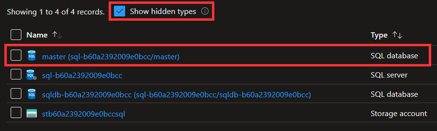

# Terraform Baseline

Terraform baseline is:

- A set of best practices for creating reusable Terraform modules using the Azure provider.
- A library of reusable Terraform modules that have been created using these best practices.

Before using Terraform baseline, you should be familiar with the following pages from the official Terraform documentation:

- [Standard Module Structure](https://developer.hashicorp.com/terraform/language/modules/develop/structure)
- [Style Guide](https://developer.hashicorp.com/terraform/language/style)
- [Version Constraints](https://developer.hashicorp.com/terraform/language/expressions/version-constraints)
- [Publishing Modules](https://developer.hashicorp.com/terraform/registry/modules/publish)

## Core principles

The best practices defined by the Terraform baseline are based on a set of core principles:

- **Simplicity:** The contents of a module should be *minimal* and *simple*.
- **Consistency**: A module should follow *consistent* naming conventions, structure and coding standards.
- **Reusability**: A module should be designed to be *reusable* across different projects and environments.
- **Transparency**: The purpose of a module should be *clear* and *well-documented*.
- **Predictability**: The behavior of a module should be *predictable*.
- **Security**: A module should follow *security best practices* to minimize risks.
- **Maintainability**: A module should be easy to maintain with minimal technical depth.

## Usage

### Version updates

Use [Dependabot](https://docs.github.com/en/code-security/dependabot/dependabot-version-updates/about-dependabot-version-updates) to keep modules you use updated to the latest versions.

Create a Dependabot configuration file `.github/dependabot.yml` in your repository containing the following configuration:

```yaml
version: 2
updates:
  - package-ecosystem: terraform
    directories: [/terraform/**/*]
    groups:
      terraform:
        patterns: ["*"]
```

## Repository

- Use [this template](https://github.com/equinor/terraform-module-template) when creating your repository.

- Use the common naming convention `terraform-azurerm-<module>` when naming your repository, where `<module>` is the name of the module.

    Modules should be named after the corresponding Azure CLI group or subgroup, for example:

    - Terraform module [`key-vault`](https://registry.terraform.io/modules/equinor/key-vault/azurerm/latest) corresponds to Azure CLI group [`keyvault`](https://learn.microsoft.com/en-us/cli/azure/keyvault?view=azure-cli-latest).

    - Terraform module [`storage`](https://registry.terraform.io/modules/equinor/storage/azurerm/latest) corresponds to Azure CLI group [`storage`](https://learn.microsoft.com/en-us/cli/azure/storage?view=azure-cli-latest).

    - Terraform module [`log-analytics`](https://registry.terraform.io/modules/equinor/log-analytics/azurerm/latest) corresponds to Azure CLI subgroup [`log-analytics`](https://learn.microsoft.com/en-us/cli/azure/monitor/log-analytics?view=azure-cli-latest).

!!! note
    Azure CLI uses inconsistent separation of words in group names. We choose to consistenly separate words by `-` in module names.

- Configure the following accesses for the repository:

    | Team | Role |
    | --- | --- |
    | @equinor/terraform-baseline | `Write` |
    | @equinor/terraform-baseline-admins | `Admin` |
    | @equinor/terraform-baseline-maintainers | `Maintain` |

- Configure the following code owners in a file `.github/CODEOWNERS`:

    ```raw
    * @equinor/terraform-baseline-maintainers

    **/CODEOWNERS @equinor/terraform-baseline-admins
    ```

- Add topics `terraform-baseline` and `terraform-module` to the repository.

## Resources

- By default, configure resources based on Microsoft security recommendations, e.g. [Security recommendations for Blob storage](https://learn.microsoft.com/en-us/azure/storage/blobs/security-recommendations).

### Roles and scope

- Use resources that do not require more than `Contributor` role at the resource group scope.
  If you need to use a higher role, create an example instead.

### Hidden resources

- Don't create resources that are automatically created by Azure, e.g. hidden resources such as the `master` database for an Azure SQL server:

  

### Modules

- A single module call should create a single instance of the main resource created by the module. For example, the `web-app` module should create a single web app, and the `sql` module should create a single server. This creates a common expectation for the behavior of our modules.
- A module should not create just a single resource. Exceptions can be made if that resource requires complex configuration or a stringent set of predefined parameters.

#### Submodules

If a resource is a child of another resource:

- The parent resource should be configured as a module
- The child resource should be configured as a submodule

For example, the SQL database resource is a child of the SQL server resource (a SQL database cannot exist without a SQL server):

- The SQL server resource should be configured as a module `sql`
- The SQL database resource should be configured as a submodule `sql//modules/database`

### Control plane and data plane

- A module should only perform control plane operations (e.g., managing Storage account or Key vault), not data plane operations (e.g., managing Storage container or Key vault secret). See [control plane and data plane](https://learn.microsoft.com/en-us/azure/azure-resource-manager/management/control-plane-and-data-plane) in Microsoft docs.

  Performing data plane operations usually require workarounds for dealing with firewalls when run from an automated pipeline that deviate from the deterministic approach promoted by Terraform (e.g, temporarily disabling firewall or temporarily adding own IP to firewall).
  This may lead to the decision of disabling a resource firewall because it is preventing data plane operations from a pipeline, lowering the security of the resource.

  Data plane operations should be handled outside of Terraform.

  > **Note** Might be irrelevant depending on the implementation of github/roadmap#614.

### Conditional resources

**Conditional resources** refers to the creation of 0 or 1 resources based on a condition.

Use the `count` meta-argument to conditionally create resources based on a static value, for example a local or variable of type `string` or `bool`.

Using a variable of type `string` string is the more extensible approach, as you can add more allowed values down the road:

```terraform
variable "kind" {
  description = "The kind of Web App to create. Allowed values are \"Linux\" and \"Windows\"."
  type        = string
  default     = "Linux"

  validation {
    condition     = contains(["Linux", "Windows"], var.kind)
    error_message = "Kind must be \"Linux\" or \"Windows\"."
  }
}

resource "azurerm_linux_web_app" "this" {
  count = var.kind == "Linux" ? 1 : 0
}

resource "azurerm_windows_web_app" "this" {
  count = var.kind == "Windows" ? 1 : 0
}
```

### Repeatable resources

**Repeatable resources** refers to the creation of 0 or more resources based on a value.

For repeatable resources, use a variable of type `map(object())` to dynamically create the resources, where setting the value to `{}` will not create any resources.

```terraform
variable "firewall_rules" {
  description = "A map of SQL firewall rules to create."

  type = map(object({
    name             = string
    start_ip_address = string
    end_ip_address   = string
  }))

  default = {}
}

resource "azurerm_mssql_firewall_rule" "this" {
  for_each = var.firewall_rules

  name             = each.value.name
  start_ip_address = each.value.start_ip_address
  end_ip_address   = each.value.end_ip_address
}
```

### Repeatable nested blocks

**Repeatable nested blocks** refers to the creation of 0 or more [dynamic blocks](https://developer.hashicorp.com/terraform/language/expressions/dynamic-blocks) based on a value.

For repeatable nested blocks, use a variable of type `list(object())` to dynamically create the nested blocks, where setting the value to `[]` will not create any nested blocks:

```terraform
variable "auth_settings_active_directory" {
  description = "A list of authentication settings using the Active Directory provider to configure for this Linux web app."

  type = list(object({
    client_id                  = string
    client_secret_setting_name = string
  }))

  default = []
}

resource "azurerm_linux_web_app" "this" {
  # omitted

  auth_settings {
    enabled = length(var.auth_settings_active_directory) == 0 ? false : true

    dynamic "active_directory" {
      for_each = var.auth_settings_active_directory

      content {
        client_id                  = active_directory.value["client_id"]
        client_secret_setting_name = active_directory.value["client_secret_setting_name"]
      }
    }
  }
}
```

### Non-repeatable nested blocks

**Non-repeatable nested blocks** refers to the creation of 0 or 1 dynamic blocks based on a value.

For non-repeatable nested blocks, use a variable of type `object()` to dynamically create the nested block, where setting the value to `null` will not create the nested block:

```terraform
variable "blob_properties" {
  description = "The blob properties for this storage account."

  type = object({
    versioning_enabled  = optional(bool, true)
    change_feed_enabled = optional(bool, true)
  })

  default = {}
}

resource "azurerm_storage_account" "this" {
  # omitted

  dynamic "blob_properties" {
    for_each = var.blob_properties != null ? [var.blob_properties] : []

    content {
      versioning_enabled  = blob_properties.value["versioning_enabled"]
      change_feed_enabled = blob_properties.value["change_feed_enabled"]
    }
  }
}
```

!!! abstract "Rationale"
    A nested block may not be supported in certain scenarios. For example, the `blob_properties` nested block for the `azurerm_storage_account` resource is only supported if the value of the `account_kind` argument is set to `StorageV2` or `BlobStorage`.

!!! info "Exceptions"
    - Blocks that are defined as required by the provider (e.g. the [`site_config` block](https://registry.terraform.io/providers/hashicorp/azurerm/3.0.2/docs/resources/linux_web_app#site_config) for the `azurerm_linux_web_app` resource).
    - Blocks that are optional but requires an argument to enable/disable its functionality (e.g. the [`auth_settings` block](https://registry.terraform.io/providers/hashicorp/azurerm/3.0.2/docs/resources/linux_web_app#auth_settings) for the `azurerm_linux_web_app` resource which requires an argument `enabled`).

## Variables and outputs

### General

- All arguments should be made available as variables.
- All attributes should be made available as outputs.

### Variable and output names

- Variables should follow a common naming convention:

     ```plaintext
     <resource>_<block>_<argument>
     ```

- Outputs should follow a common naming convetion:

     ```plaintext
     <resource>_<block>_<attribute>
     ```

    !!! info "Exception"
        Variable and output names that contain the module name. For example, in module `storage` the variable `storage_account_name` should be named `account_name` instead.

### Variable and output descriptions

- Use description to describe the values of variables and outputs.
- If valid variable values is known:
    1. If set of valid values is known, append to description:

        ```plaintext
        Value must be X or Y.
        ```

        Else, if range of valid values is known, append to description:

          ```plaintext
          Value must be between X and Y.
          ```

        Else, if subset of valid values is known, append to description:

          ```plaintext
          Possible values include X, Y and Z.
          ```

        Else, if format of valid values is known, append to description:

          ```plaintext
          Value must be in F format, e.g. X, Y and Z.
          ```

    1. Add [custom validation rules](https://developer.hashicorp.com/terraform/language/values/variables#custom-validation-rules) to check if variable value is valid.

### Variable and output types

- Use simple types (`string`, `number` and `bool`) over complex types (`list`, `object` and `map`) for variables and outputs where possible:

    !!! abstract "Rationale"
        Variables and outputs of simpler types are easier to write good descriptions for. For example, it's easier to write a good description for a simple `string` than for an `object` with multiple `string` properties. It's also easier for a user to pass a simple `string` to a variable than to construct and pass a complex `object`.

## Meta-arguments

### Lifecycle

- The [`prevent_destroy` lifecycle meta-argument](https://developer.hashicorp.com/terraform/language/meta-arguments/lifecycle#prevent_destroy) should be used on stateful resources (e.g. databases) to mitigate the possibility of accidental data loss.
- The [`ignore_changes` lifecycle meta-argument](https://developer.hashicorp.com/terraform/language/meta-arguments/lifecycle#ignore_changes) should be used sparingly, as heavy use could lead to configuration drift.

## Testing

- Automated tests should be implemented for all variants of the relevant resource using [Terratest](https://terratest.gruntwork.io/). For example, in the `storage` module, automated tests should be implemented for standard GPv2 storage, premium GPv2 storage, standard blob storage, premium block blob storage and premium file storage.
